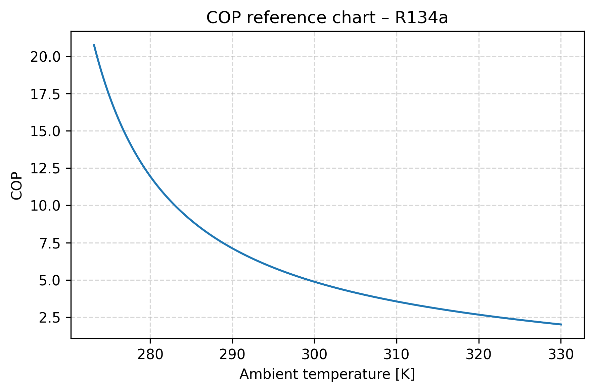
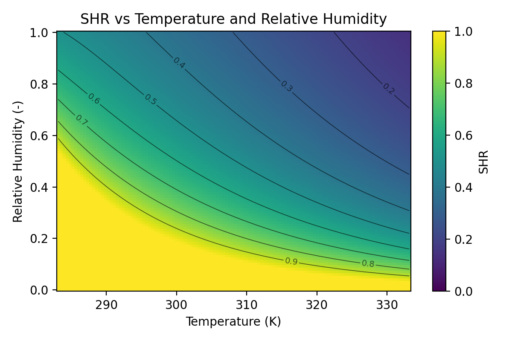
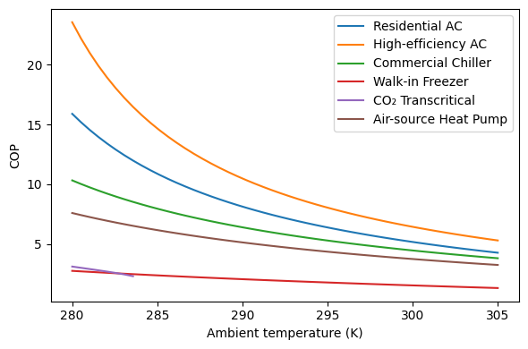
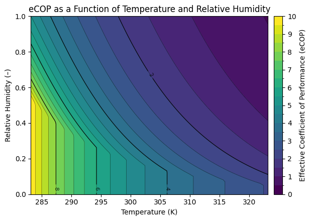

================================================================
CEDAR: Climate & Energy Diagnostics for Applied Refrigeration
================================================================

**CEDAR: Climate & Energy Diagnostics for Applied Refrigeration** connects *climate data* to *refrigeration physics and energy performance* for both **COP** and **SHR** workflows.

.. image:: https://zenodo.org/badge/DOI/10.5281/zenodo.18274828.svg
   :target: https://doi.org/10.5281/zenodo.18274828
   :alt: DOI Badge

.. image:: https://img.shields.io/badge/Nature_Communications-published-2ea44f
   :target: https://doi.org/10.1038/s41467-026-75388-9
   :alt: Published in Nature Communications

.. grid:: 1 2 2 2
   :margin: 2 2 2 2
   :padding: 2
   :gutter: 2
   :class-container: main-grid

   .. grid-item-card:: Quick Start
      :link: getting-started
      :link-type: doc
      :shadow: md
      :text-align: center
      :class-card: index-card

      New to the platform? Learn installation, dependencies, and core concepts in minutes (COP + SHR).

   .. grid-item-card:: COP, SHR, ECOP, CDD/eCDD
      :link: user-guide/cop-quickstart
      :link-type: doc
      :shadow: md
      :text-align: center
      :class-card: index-card

      Explore COP, SHR, ECOP (COP × SHR), and CDD/eCDD workflows with worked examples.

   .. grid-item-card:: Examples (Learn by doing)
      :link: examples
      :link-type: doc
      :shadow: md
      :text-align: center
      :class-card: index-card

      Run the COP and SHR Python examples to generate charts and CSVs in `examples/outputs/`.

   .. grid-item-card:: Cedar walkthrough (notebook-based)
      :link: user-guide/cedar-walkthrough
      :link-type: doc
      :shadow: md
      :text-align: center
      :class-card: index-card

      A narrative tutorial adapted from `cedar.ipynb` with additional figures and use cases.

**Highlights**

- COP: vectorized `SingleFluidCOP` plus low-level `cop_single`.
- SHR: dew point → RH conversion or direct RH input via `SensibleHeatRatioModel`.
- Examples: runnable Python scripts for both workflows (`examples/`).
- Reproducible: tested APIs with coverage gates and Sphinx docs.

.. toctree::
   :maxdepth: 2
   :caption: Get started
   :hidden:

   getting-started
   installation

.. toctree::
   :maxdepth: 2
   :caption: User guide
   :hidden:

   user-guide/cop-quickstart
   user-guide/cedar-walkthrough

.. toctree::
   :maxdepth: 1
   :caption: Examples
   :hidden:

   examples

.. toctree::
   :maxdepth: 2
   :caption: API Reference
   :hidden:

   api/index

.. toctree::
   :maxdepth: 1
   :caption: Project
   :hidden:

   citation
   contributing
